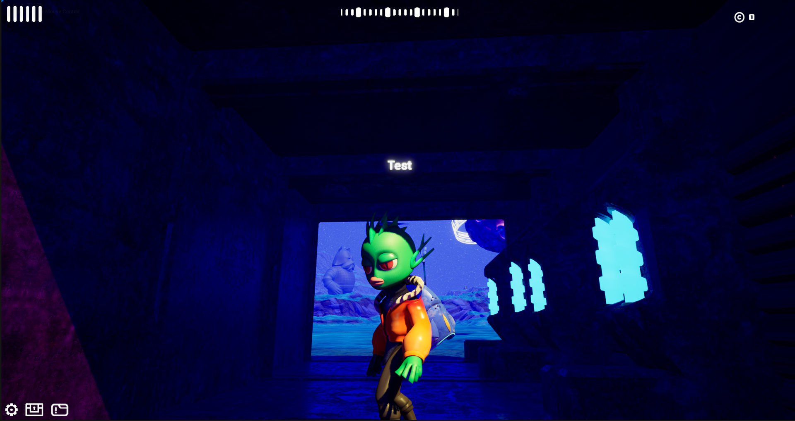

# Moonland´s Current Stage

The development team has built all the core aspects of the Moonland Metaverse. Our  movement  system,  flying  system,  and  all  base  world systems have been fleshed out. This includes player login, zone spawning, character selection, inventory system, and quest system.

Alongside the enemy and NPC work, outside the game itself, we have been able to work out the Game Installer, automatic update system, and initial server infrastructure deployed for **early access and alpha testing.**

With this first level of detail for Moonland’s technology underway in just over one year, the Moonland Dev team has created the foundation that Moonland will build upon for the years to come.

The Moonland team has officially started letting in for the first time our **NFT holders**! The dev is currently  concentrating on finishing the in game quests in order to get **Moonland´s** T2E ( Test 2 Earn) campaigns started!&#x20;

Moonland´s NFT holders will be able to not only test Moonland but also get rewarded for doing it! Our NFT holders will have to complete some quests and compete against each other in order to **EARN!**

<figure><figcaption>
Showing off Moonland´s playable demo at Consensus 2023
</figcaption></figure>

 

<figure><figcaption>
Off to Rome! After Consensus 2022 we went to Blockchain week Rome! Attendees had the opportunity to play  Moonland!
</figcaption></figure>

<figure><figcaption></figcaption></figure>

<figure><figcaption></figcaption></figure>

<figure><figcaption></figcaption></figure>

<figure><figcaption></figcaption></figure>

>

<figure><figcaption></figcaption></figure>
