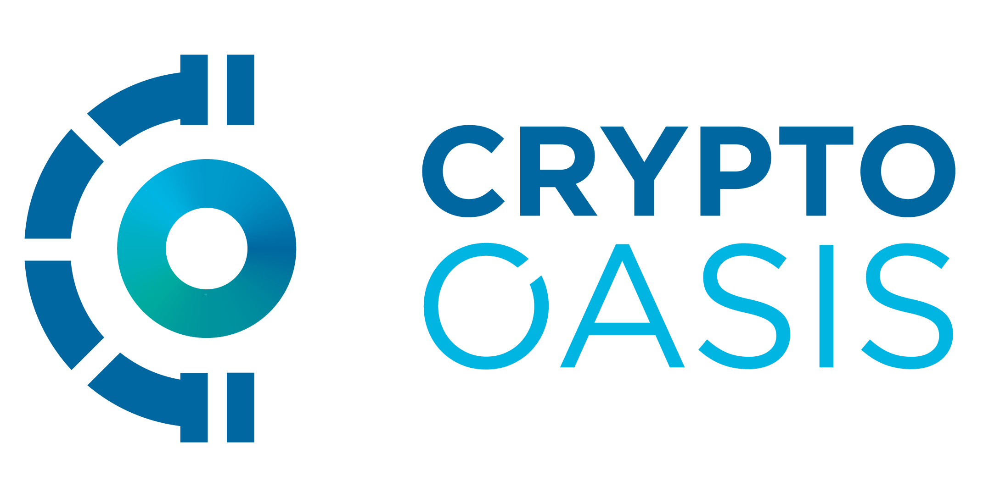
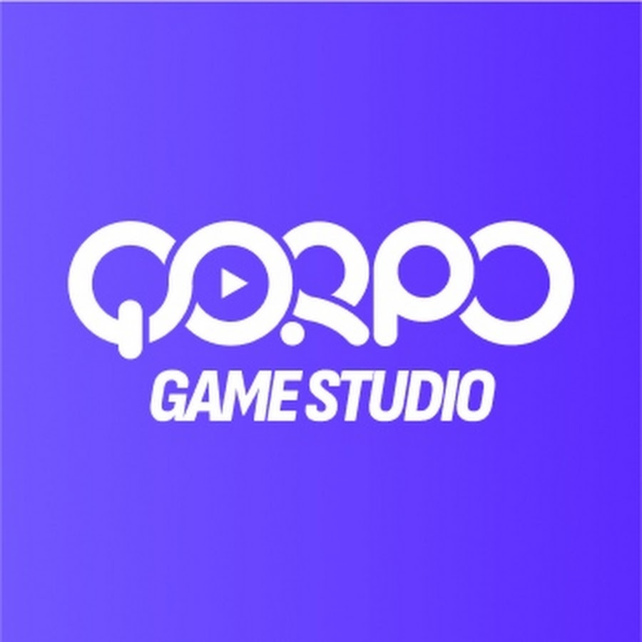

# Project Partnerships and Collaborations

Moonland Metaverse, created by Meta Studios, prides itself on forging strategic partnerships with leading entities in the blockchain and gaming industries. These partnerships enable us to provide the best virtual experiences and contribute to the overall growth and development of the project.

## Crypto Oasis

Crypto Oasis is a blockchain ecosystem primarily focused on the Middle East and backed by the initiators of Crypto Valley Switzerland. The ecosystem is composed of various stakeholders including investors, startups, corporates, research institutions, service providers, and government entities. The ecosystem aims to bring together all the core elements necessary for growth: Talent, Capital, and Infrastructure.

<figure><figcaption></figcaption></figure>

Crypto Oasis has become one of the fastest-growing blockchain ecosystems in the world with over 1,000 organizations established in the UAE alone. They project to identify over 1,500 established organizations across the region by the end of 2022. Our partnership with Crypto Oasis offers us an expansive network and potential collaborations with blockchain-focused entities across the Middle East.

## **Qorpo Gaming Studio**

Qorpo is a renowned gaming studio that has made significant strides in the web3 gaming arena. They are known for their innovative gaming titles such as Citizen Conflict, AniMate, and Eggos.

<figure><figcaption></figcaption></figure>

* **Citizen Conflict** is a free-to-play, team-based shooter game set in the dystopian world of Ether Islands, where every match is a fight for survival and valuable loot.
* **AniMate** is an upcoming open-world Battle Royale adventure that combines creature-catching action with immersive exploration.
* **Eggos** is a multiplayer social action game that introduces players to funny challenges that can be enjoyed on smartphones.

Qorpo's experience and successes in creating engaging and innovative games make them an invaluable partner for Moonland Metaverse. With their expertise, we aim to create immersive gaming experiences within our metaverse that keep our community engaged and entertained.

## **Qtum**

Qtum is an open-source, decentralized blockchain platform that leverages the security of UTXO while enabling the AAL (Account abstraction layer) which allows for the use of EVM Smart Contracts on Qtum.&#x20;

\
\
Qtum's Layer 2 solutions and DeFi-oriented approach allow it to provide the robust infrastructure necessary for real-world, decentralized applications.\
Recently, Qtum has started a strong push towards Web3 technologies, which made this partnership a win-win situation for both projects.

<figure><figcaption></figcaption></figure>

Our partnership with Qtum brings along technical expertise and resources that significantly boost the development and execution of our blockchain-based solutions within the Moonland Metaverse. This partnership also opens up avenues for further collaborations and integration of more advanced blockchain technologies, enhancing the overall user experience in our Metaverse.
