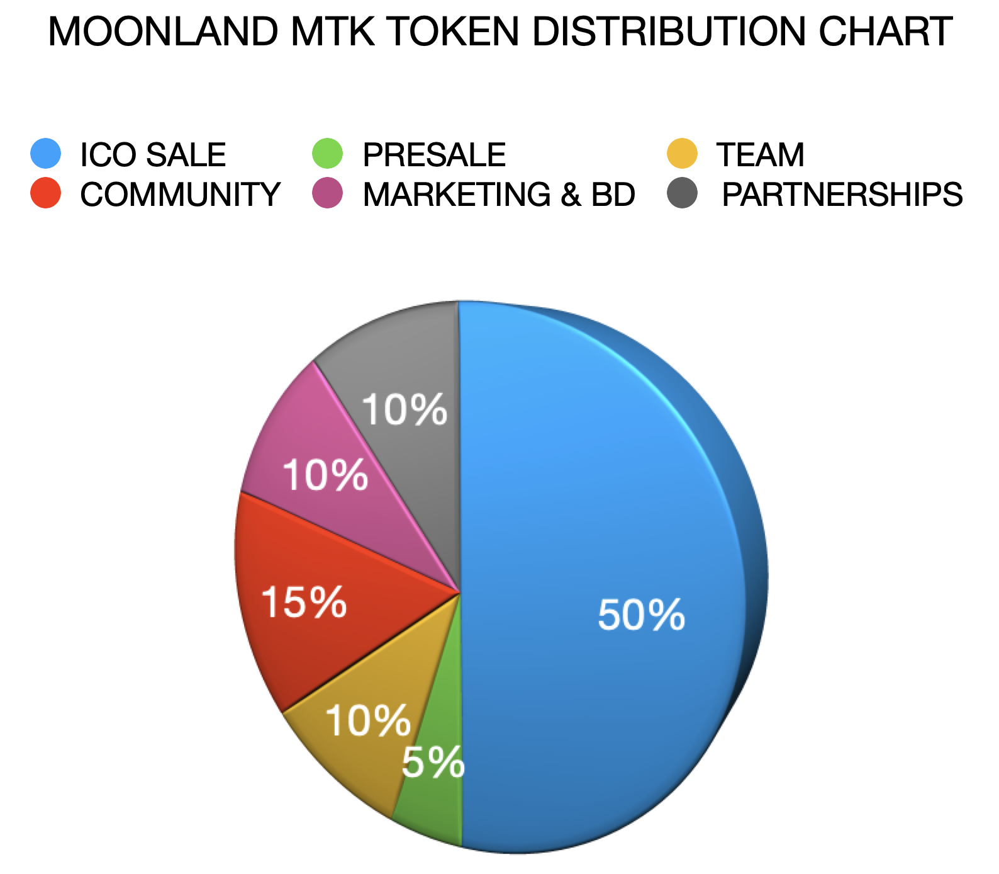

# Tokenomics

## Moonland Metaverse (MTK) Tokenomics

### Token Information

* **Token Name:** Moonland Metaverse Token
* **Token Symbol:** MTK
* **Total Supply:** 1,234,567,890 MTK
* **ICO Price:** $0.21 per MTK token
* **PRESALE Price:** $0.18 per MTK token

### Token Distribution

* **ICO Sale (50%, 617,283,945 MTK Tokens):**
* **Presale (5%, 61,728,395 MTK Tokens):**
* **Team (10%, 123,456,789 MTK Tokens):**
* **Marketing and Business Development (10%, 123,456,789 MTK Tokens):**
* **Partnerships (10%, 123,456,789 MTK Tokens):**
* **Community (15%, 185,185,184 MTK Tokens):**

<figure><figcaption></figcaption></figure>

### Token Utility

The MTK tokens will serve multiple purposes within the Moonland Metaverse:

* **Access:** MTK tokens can be used to access premium features in the metaverse.
* **Governance:** Token holders can vote on various decisions regarding the future development of the metaverse.
* **Rewards:** MTK tokens can be earned as rewards for various activities within the metaverse.
* **NFT Market:** MTK tokens can be used to buy, sell, and trade NFTs in the marketplace.
* **Discounts & Bonuses:** Moonlanders will be able to buy, sell and NFTs and other items in the metaverse with many different tokens. Transactions done with the MTK token will always get a discount of 11%.
